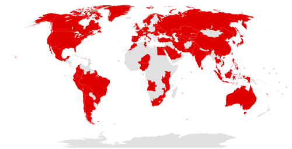

# WannaCry Ransomware Attacke

**Fakten / Zahlen / Daten**

- Aliases: WannaCrypt, Wana Decrypt0r 2.0, WanaCrypt0r 2.0, Wanna Decryptor.
- Ausbruchsdatum: 12 bis 15 Mai 2017
- Dauer: 4 Tage
- Typ: Cyberattacke, Ransomware
- Schaden: mehr als 200'000 Computer in 150 Ländern
- OS : MS-Windows
- Ursprungsort: Pyongyang, Nortdkorea
- Autoren: unbekannt, verdächtigt: Lazarus Group

**Globaler Impact:**

**Details zur Software**

Der heute als WannaCry bekannte Ransomware Angriff ist ein Netzwerkwurm der spezifisch Microsoft Betriebssysteme angreift.
Der Angriff ist daran zu erkennen, dass Benutzerdateien verschlüsselt und für den Besitzer des Gerätes unbrauchbar werden.
Einzig durch die Zahlung von Bitcoin lassen sich die Daten retten, dies behaupten zumindest die Angreifer. Sollte sich 
der User weigern zu Zahlen, weerden nach Ablauf einer Frist alle Daten gelöscht.

Die Schadsoftware ist jedoch nicht nur für den infizierten Rechner gefährlich, 
da es sich hierbei um einen "Wurm" handelt welcher auch andere Windowsgeräte im selben Netwerk infizieren kann und die 
als "DoublePulsar" bekannte Backdoor installiert.

**Schäden**

Exakte Zahlen sind unmöglich zu erfassen, es ist jedoch noch Hunderttausenden von Rechnern die Rede. Dies beinhaltet Tankstellen, 
Videoüberwachungsanlagen und auch Telekommunikationsunternehmen.

**Reaktionen**

Eine der Reaktionen war die zufällige Entdeckung eines kill switches, welcher durch die Registrierung einer Domain erfolgte.
Wieso dies funktionierte ist bis heute nicht genau geklärt.

Die richtige Reaktion, war ein Patch von Microsoft welcher die Sicherheitslücke schliessen konnte. Dieser wurde noch im Mai
direkt zur Verfügung gestellt.

**Fun Facts**

Kurz nach der Attacke wurde eine andere Schadsoftware namens "EternalRocks" entdeckt, welche sich als WannaCry ausgegeben hat um unentdeckt zu bleiben.